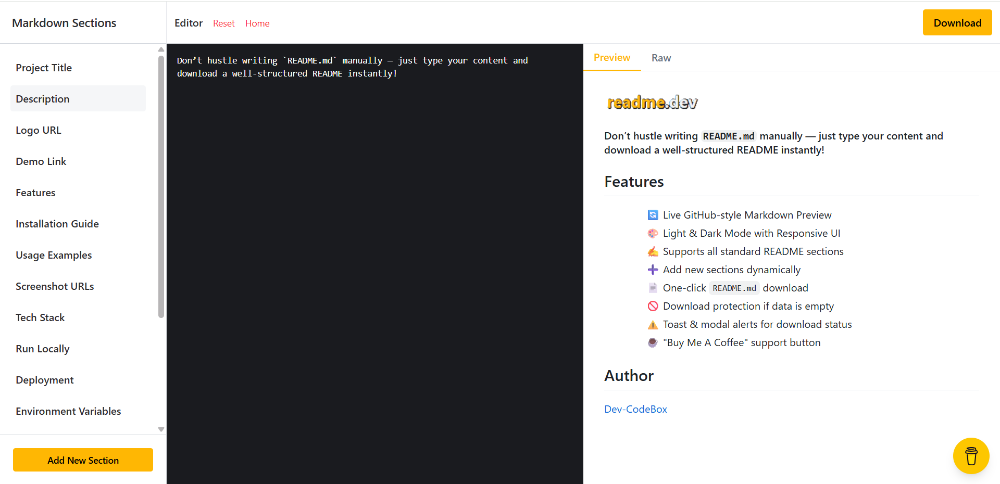
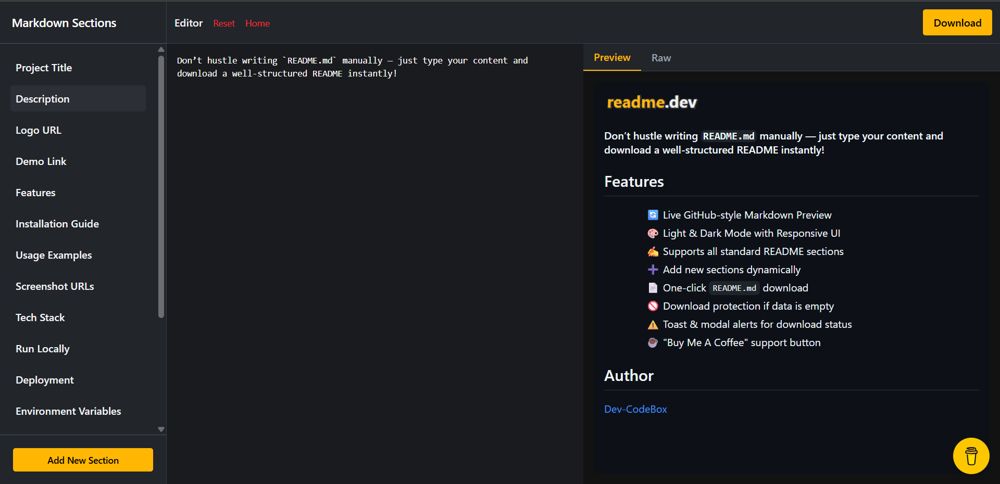

#### A full-stack web application that empowers developers to effortlessly generate well-structured `README.md` files by simply entering project content — saving time, eliminating manual formatting, and streamlining documentation with live preview and instant download.

## 🛠️ Tech Stack

- **Frontend:** React.js, Tailwind CSS, DaisyUI, React Markdown, GitHub-Markdown-CSS
- **Backend:** Node.js, Express.js
- **Others:** Axios, Vite, dotenv, CORS

## 📦 Features

- 🔄 Live GitHub-style Markdown Preview
- 🎨 Light & Dark Mode with Responsive UI
- ✍️ Supports all standard README sections
- ➕ Add new sections dynamically
- 📄 One-click `README.md` download
- 🚫 Download protection if data is empty
- ⚠️ Toast & modal alerts for download status
- ☕ "Buy Me A Coffee" support button

## 📥 Installation

```bash
git clone https://github.com/Dev-CodeBox/readme.dev.git
cd readme.dev

cd client
npm install

cd ..

cd server
npm install
```

## 🧪 Run Locally

```bash
# Start the backend
cd server
npm run dev

# Start the frontend in a new terminal
cd client
npm run dev
```

> **Note**: Create a `.env` file in the backend folder:

```env
PORT=5000
CORS_ORIGIN=http://localhost:5173
```

> And a `.env` in client folder:

```env
VITE_API_BASE_URL=http://localhost:5000/api/v1
VITE_DONATION_LINK=https://www.buymeacoffee.com/yourname
VITE_GITHUB_SPONSOR_LINK=https://github.com/sponsors/yourname
```

## 📄 API Reference

### POST `/api/v1/generate`

Generates and sends the Markdown as a downloadable `README.md`.

#### Request Body:

```json
{
  "projectTitle": "My Project",
  "description": "This is an auto-generated README",
  "etc": "..."
}
```

#### Response:

- Triggers file download of `README.md`.

## 🌐 Environment Variables

- `PORT`
- `CORS_ORIGIN`
- `VITE_API_BASE_URL`
- `VITE_DONATION_LINK`
- `VITE_GITHUB_SPONSOR_LINK`

## 📷 Screenshots

### Light Mode



### Dark Mode



## 🤝 Contributing

Contributions, issues and feature requests are welcome!  
Fork the repo and make changes on a new branch.

## 📃 License

MIT © [Dev Raj Singh](https://www.linkedin.com/in/dev-raj-singh04/)

## 👨‍💻 Author

- [Dev Raj Singh](https://github.com/Dev-CodeBox)

## 🙏 Acknowledgements

- [GitHub Markdown CSS](https://github.com/sindresorhus/github-markdown-css)
- [React Markdown](https://github.com/remarkjs/react-markdown)
- [DaisyUI](https://daisyui.com)
